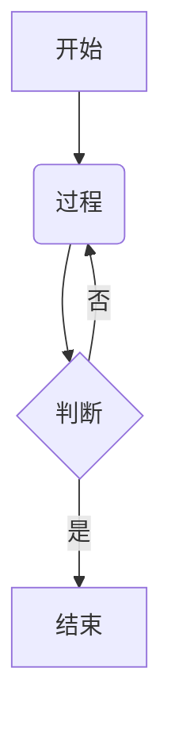

# Obsidian Markdown 语法大全

## 基础语法

### 标题
```
# H1
## H2
### H3
#### H4
##### H5
###### H6
```

### 强调
*斜体* 或 _斜体_  
**粗体** 或 __粗体__  
***加粗斜体*** 或 ___加粗斜体___  
~~删除线~~  
`高亮文本`  

### 列表
- 无序列表
  - 子项
    - 子子项

1. 有序列表
   2. 子项
      1. 子子项

- [ ] 任务列表
- [x] 已完成任务


### 链接与图片
[内部链接](其他笔记)  
[带别名链接](其他笔记|别名)  
[外部链接](https://obsidian.md)  
  

### 引用
> 这是引用
>> 嵌套引用

### 分割线
---

## Obsidian 特有语法

### 内部链接
[[笔记名称]]  
[[笔记名称#标题]]  
[[笔记名称|显示别名]]  

### 标签
#标签  
#多词标签  

### 脚注
这是一个脚注[^1]的示例。

[^1]: 这是脚注的内容。

### 代码块
```javascript
// 语法高亮代码块
function test() {
  console.log("Hello Obsidian!");
}
```

### 表格
| 左对齐 | 居中对齐 | 右对齐 |
|:-------|:--------:|-------:|
| 数据1  |  数据2   |  数据3 |
| 数据4  |  数据5   |  数据6 |

### 数学公式
行内公式：$E=mc^2$

块公式：
$$
\sum_{i=1}^n i = \frac{n(n+1)}{2}
$$

### 注释
%% 这是注释，不会在预览中显示 %%

### 嵌入内容
![[其他笔记]]  
![[图片.png]]  
![[视频.mp4]]  

### 目录
```toc
```

### 高亮
==高亮文本==

### 行内代码
`print("Hello World")`

### YAML Frontmatter
```yaml
---
title: 笔记标题
date: 2023-03-15
tags: [tag1, tag2]
---
```

## 高级功能

### 数据视图
```dataview
LIST FROM #tag AND !"done"
```

### 模板变量
<% tp.file.title %>

### 图表（Mermaid）


### 折叠内容
<details>
<summary>点击展开</summary>

折叠的内容在这里
</details>

### 多栏布局
```start-multi-column
ID: ExampleID
number of columns: 3
shadow: on
border: on
```

第一栏内容

--- column-end ---

第二栏内容

--- column-end ---

第三栏内容

```end-multi-column
```

### 提示框
> [!NOTE]
> 这是一个提示框
> 
> [!TIP]
> 这是一个小技巧
> 
> [!WARNING]
> 这是一个警告
> 
> [!DANGER]
> 这是一个危险警告
> 
> [!FAQ]
> 这是一个问题
> 
> [!SUCCESS]
> 这是一个成功提示

---

*最后更新: {{date:YYYY-MM-DD}}*